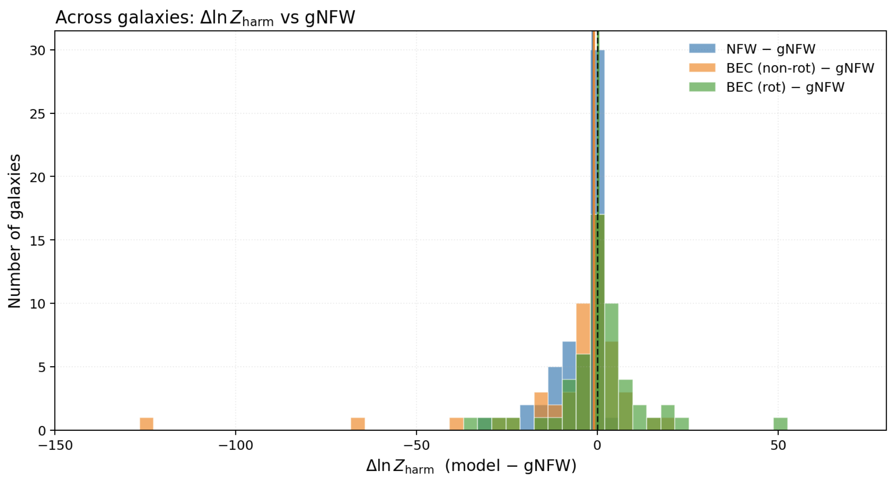
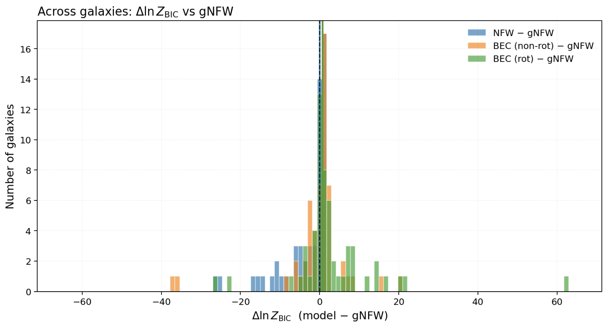

# bec-nfw-gnfw-halo-comparison

# Bayesian Comparison of BEC, NFW, and gNFW Halo Models Using Galaxy Rotation Curves

> A Bayesian study comparing Bose–Einstein Condensate (BEC), Navarro–Frenk–White (NFW), and generalized NFW (gNFW) dark-matter halo models using rotation curves from the SPARC galaxy database.

---

##  Overview

This project statistically compares three dark matter halo models — **NFW**, **gNFW** (with a free inner slope), and **BEC** (with and without rotation) — by fitting them to observed galaxy rotation curves from the **SPARC** dataset.  

We use **Markov Chain Monte Carlo (MCMC)** sampling to fully explore the parameter posteriors and compute **Bayesian evidences** via both the **Bayesian Information Criterion (BIC)** and **harmonic-mean estimator**.

---

## Key Findings

- Allowing a free inner slope (gNFW) yields a consistent evidence gain relative to fixed-slope NFW.
- BEC halos show larger galaxy-to-galaxy variability — some fits strongly favour BEC, while others disfavor it.
- The **rotating BEC** variant achieves the best mean evidence but remains highly non-uniform across the sample.

| Model | Δln Z (median [IQR]) |  
|-------|----------------------|  
| NFW | −1.5 [−6.4, 0.7] |  
| BEC (non-rot.) | −1.9 [−8.9, 2.3] |  
| BEC (rot.) | +1.1 [−1.1, 7.8] |

---

##  Methods

- **Bayesian inference** with MCMC sampling (`emcee`)
- **Evidence estimation:** BIC and harmonic-mean
- **Profiles implemented:**
  - NFW: $\rho = \frac{\rho_s}{(r/r_s)(1+r/r_s)^2}$
  - gNFW: $\rho = \frac{\rho_s}{(r/r_s)^\alpha (1+r/r_s)^{3-\alpha}}$
  - **BEC (non-rotating):** $\rho = \rho_c \, \dfrac{\sin(\pi r / R)}{\pi r / R}$  
  - **BEC (rotating)[arXiv:2007.12222](https://arxiv.org/abs/2007.12222):** $v_{\mathrm{tg}}^2(r) = 80.861 \left( \dfrac{\rho_c}{10^{-24}\,\mathrm{g/cm^3}} \right) \left( \dfrac{R}{\mathrm{kpc}} \right)^2 \left[ (1 - \Omega^2)\left( \dfrac{\sin(\pi r / R)}{\pi r / R} - \cos\left(\dfrac{\pi r}{R}\right) \right) + \dfrac{\Omega^2}{3}\left( \dfrac{\pi r}{R} \right)^{2} \right]$

- **Data:** SPARC galaxy rotation curves ([Lelli et al. 2016](https://arxiv.org/abs/1606.09251))

### Model Parameters and Priors

Each halo model introduces a set of free parameters that, together with the baryonic components, determine the predicted rotation curve.  
The table below summarizes the parameters used in the NFW, gNFW, and BEC (non-rotating and rotating) halo models, along with their physical interpretation and prior distributions adopted in the Bayesian inference.

| **Model** | **Parameter** | **Meaning** | **Prior** |
|------------|---------------|--------------|------------|
| **NFW** | `log M_h` | Halo virial mass | $\mathcal{U}(8, 13)$ |
|  | `log c` | Halo concentration | $\mathcal{U}(0.3, 1.0)$ |
|  | `log Υ_d` | Disk mass-to-light scaling | $\mathcal{N}(-0.3, 0.1)$ |
|  | `log Υ_b` | Bulge mass-to-light scaling | $\mathcal{N}(-0.15, 0.1)$ |
| **gNFW** | `log M_h` | Halo virial mass | $\mathcal{U}(8, 13)$ |
|  | `log c` | Halo concentration | $\mathcal{U}(0.3, 1.0)$ |
|  | `α` | Inner slope parameter | $\mathcal{U}(0.0, 1.5)$ |
|  | `log Υ_d` | Disk mass-to-light scaling | $\mathcal{N}(-0.3, 0.1)$ |
|  | `log Υ_b` | Bulge mass-to-light scaling | $\mathcal{N}(-0.15, 0.1)$ |
| **BEC (non-rot.)** | `log ρ_c` | Central density of condensate | $\mathcal{U}(-26, -22)$ |
|  | `R_BEC` | Condensate halo radius (kpc) | $\mathcal{U}(0, 30)$ |
|  | `log Υ_d` | Disk mass-to-light scaling | $\mathcal{N}(-0.3, 0.1)$ |
|  | `log Υ_b` | Bulge mass-to-light scaling | $\mathcal{N}(-0.15, 0.1)$ |
| **BEC (rot.)** | `log ρ_c` | Central density of condensate | $\mathcal{U}(-26, -22)$ |
|  | `R_BEC` | Condensate halo radius (kpc) | $\mathcal{U}(0, 30)$ |
|  | `Ω` | Dimensionless rotation parameter | $\mathcal{U}(0, 1)$ |
|  | `log Υ_d` | Disk mass-to-light scaling | $\mathcal{N}(-0.3, 0.1)$ |
|  | `log Υ_b` | Bulge mass-to-light scaling | $\mathcal{N}(-0.15, 0.1)$ |

## Result — Bayesian Evidence Relative to NFW

The core result of this analysis is the Bayesian evidence difference (Δln Z) of each model relative to the NFW halo baseline.  

- **Δln Z > 0** → alternative model preferred over NFW  
- **Δln Z < 0** → NFW preferred  
- **Evidence computed via:**  
  - Harmonic mean estimator (posterior-based, integrated over MCMC samples)  
  - Bayesian Information Criterion (BIC) approximation (analytic cross-check)  

| Harmonic Mean Evidence (Δln Z vs NFW) | BIC Approximation (Δln Z vs NFW) |
|:------------------------------------:|:--------------------------------:|
|  |  |

> Each histogram shows the distribution of Δln Z across the SPARC galaxy sample.  
> Positive tails indicate galaxies better fit by gNFW or rotating BEC models.

## Result (Posterior Distributions)

**BEC (rot vs non-rot)**  
  
  
 
  

  

**NFW vs gNFW**  
  
  
 
  

- Red (filled): gNFW or rotating BEC; Blue (dashed): NFW or non-rotating BEC (match your plotting scheme).
- Typical parameters shown: halo mass/concentration (NFW/gNFW), inner slope α (gNFW), and BEC parameters \(\rho_c, R, \Omega\), plus \(\Upsilon_d, \Upsilon_b\).

